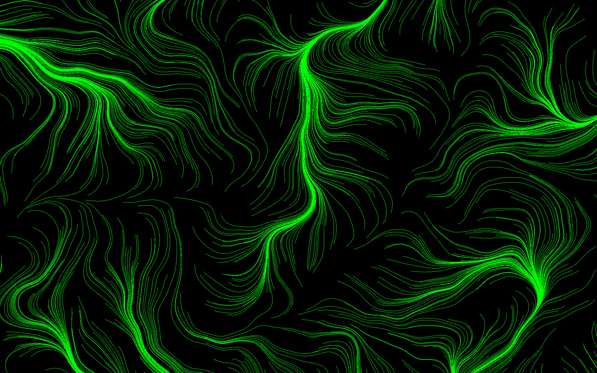

| Computer Graphics and Interaction |
| --------------------------------- |
| Tiago Maranhao Barreto Pereira    |

# Project Specification v1.2

After the feedback, I am scrapping Idea 1 altogether and adding a third idea instead.

## Idea 2 - flowfields

Learn how to use WebGL and implement a flow field particle simulation for the browser. This could be used to simulate phenomena such as wind, smoke, and rivers, but also to create beautiful generative, abstract digital art.

Maybe make it interactive, allowing users to tinker with the simulation parameters.

    
    

As a reference, I thought I could use this ["Creating Evenly-Spaced Streamlines of Arbitrary Density"](https://link.springer.com/chapter/10.1007/978-3-7091-6876-9_5) paper:

> This paper presents a new evenly-spaced streamlines placement algorithm to visualize 2D steady flows. The main technical contribution of this work is to propose a single method to compute a wide variety of flow field images, ranging from texture-like to hand-drawing styles. Indeed the control of the density of the field is very easy since the user only needs to set the separating distance between adjacent streamlines, which is related to the overall density of the image. We show that our method produces images of a quality at least as good as other methods but that it is computationally less expensive and offers a better control on the rendering process.

## Idea 3 - plane tesselations / tilings

The idea here is to implement the technique introduced by this paper, [An integer representation for periodic tilings of the plane by regular polygons](https://www.sciencedirect.com/science/article/pii/S0097849321000078), to create

