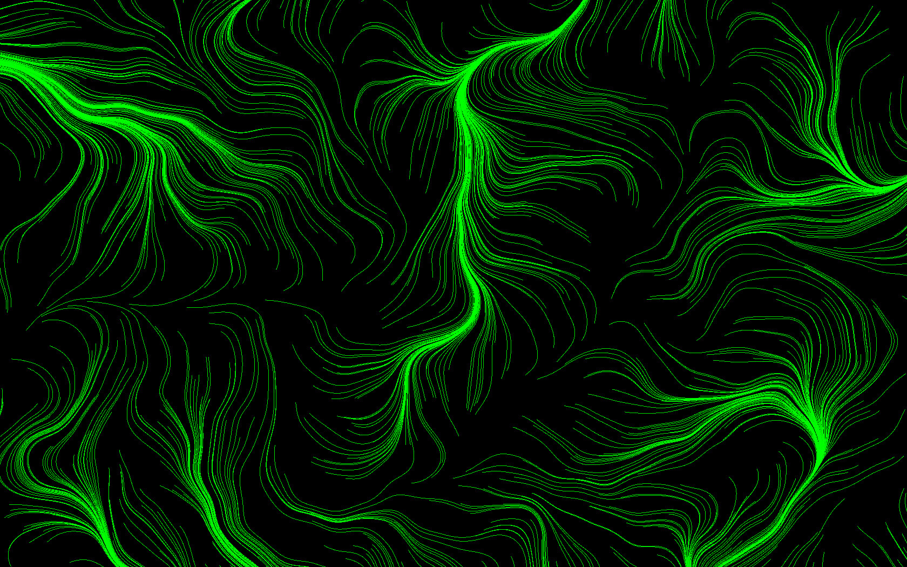

# Project Specification

It has been really difficult to choose a project! I am naturally aiming for the highest grade possible, and I have many interests, but my skills are somewhat limited (for now).  I would like to use the opportunity of the project to both learn something new and understand how things work from the ground up, so I am not interested in using existing libraries, frameworks, environments, or engines for this project.

In the end, I narrowed down my choices to two candidates, briefly described below.

## The basic idea 1

Implement from scratch a 2D raycasting system to simulate the field of view of a player/character, controllable by a user, as it navigates through a dark (and procedurally generated?) maze. To detect the line (ray) - line (wall) intersections, I would implement a differential digital analysis (DDA) algorithm. For nostalgia's sake, I would try to recreate the visuals and feel of the dungeons from one of my childhood's favorite video games: the Sega Master System's "Phantasy Star":

If there's time, study and try to implement wave function collapse to procedurally generate the dungeons, or use a randomized depth-first backtracker algorithm to build a maze.

## The basic idea 2

Learn how to use WebGL and implement a flow field particle simulation for the browser. This could be used to simulate phenomena such as wind, smoke, and rivers, but also to create beautiful generative, abstract digital art.

Maybe make it interactive, allowing users to tinker with the simulation parameters.

    
    

